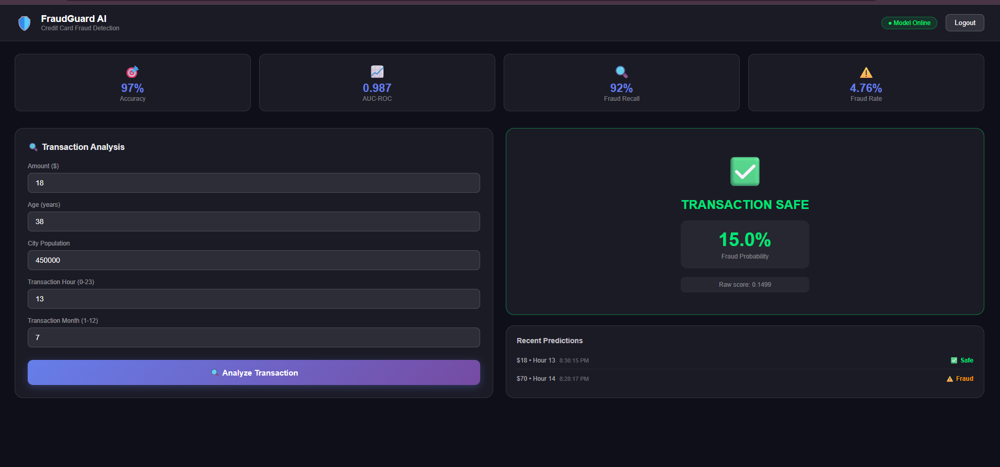
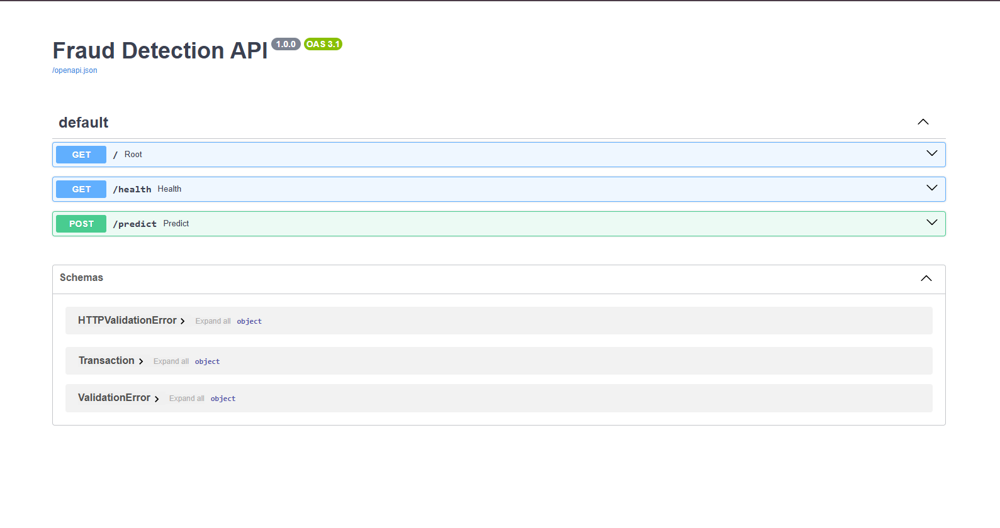
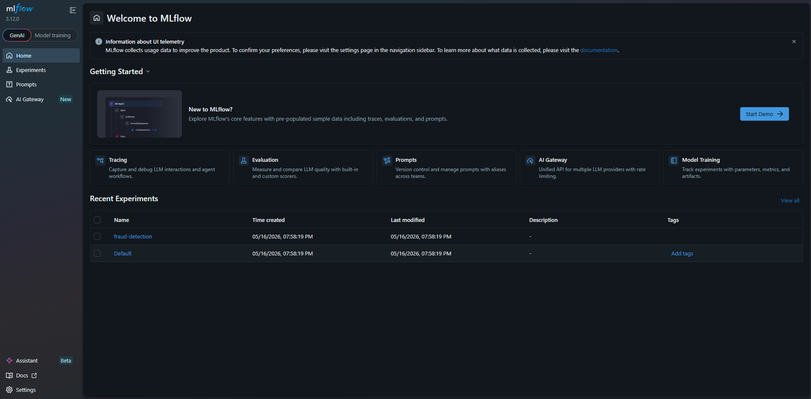
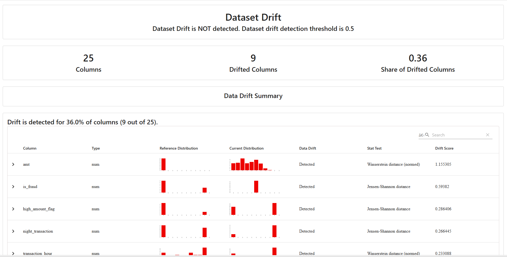
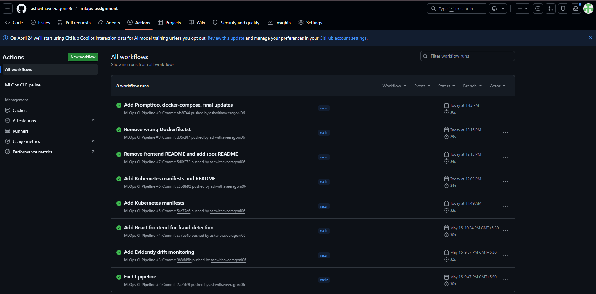
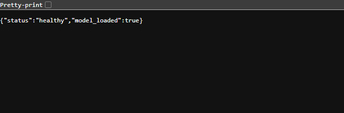

# Credit Card Fraud Detection — MLOps Pipeline
## Live Demo
> **Note:** These URLs work when running locally. Start all services using Quick Start guide below.

| Service | Local URL | Command |
|---------|-----------|---------|
| FastAPI Docs | http://localhost:8000/docs | `uvicorn fastapi_app.main:app` |
| React Frontend | http://localhost:5173 | `npm run dev` |
| MLflow UI | http://127.0.0.1:5000 | `python -m mlflow ui` |
| Grafana | http://localhost:3001 | `docker run grafana/grafana` |
| Prometheus | http://localhost:9090 | `docker run prom/prometheus` |

## Tech Stack
| Layer | Tool | Purpose |
|-------|------|---------|
| Data versioning | DVC | Track datasets |
| Data validation | Great Expectations | Validate data |
| Experiment tracking | MLflow | Track training runs |
| Model serving | FastAPI | REST API |
| Frontend | React + Vite | Prediction UI |
| Monitoring | Evidently AI | Drift detection |
| CI/CD | GitHub Actions | Auto test + build |
| Containers | Docker | Containerization |
| Orchestration | Kubernetes | Deployment |

## Quick Start

### 1. Clone repository
## Screenshots

### React Frontend

### FastAPI Swagger Docs

### MLflow Experiment Tracking

### Evidently Drift Report

### GitHub Actions CI

### FastAPI Health Check
